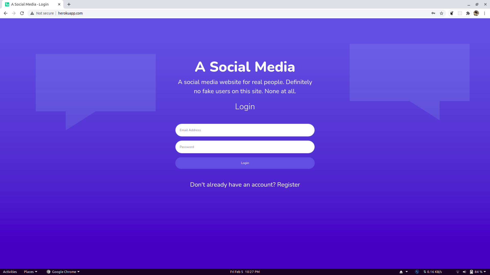
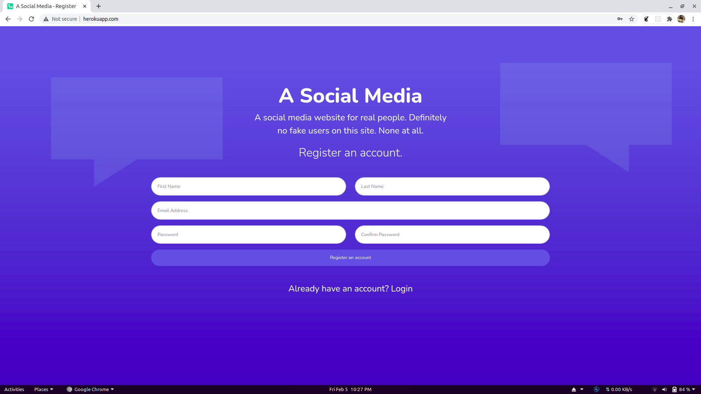
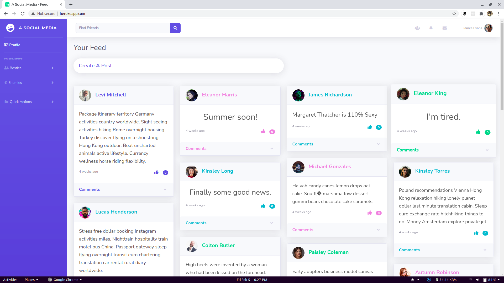
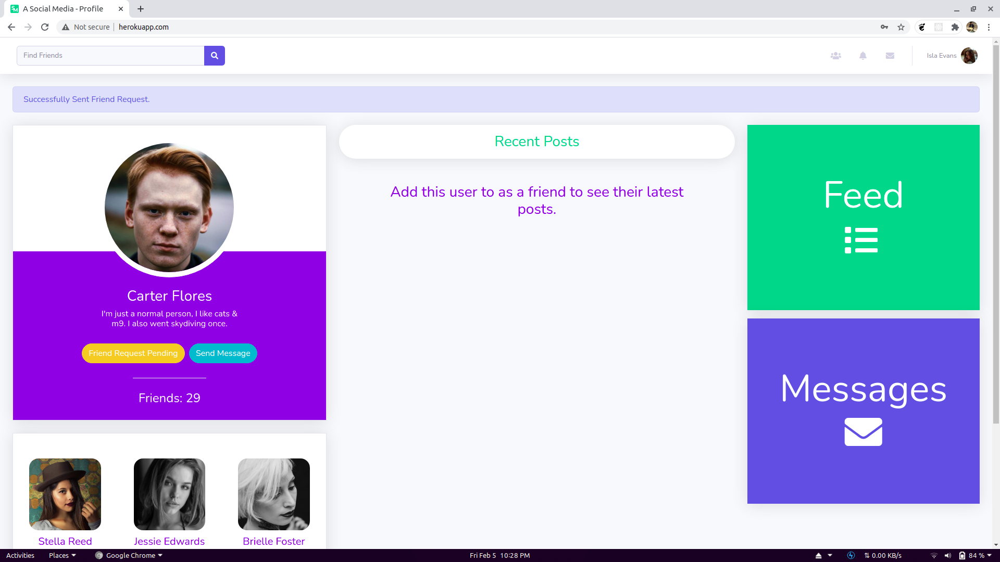
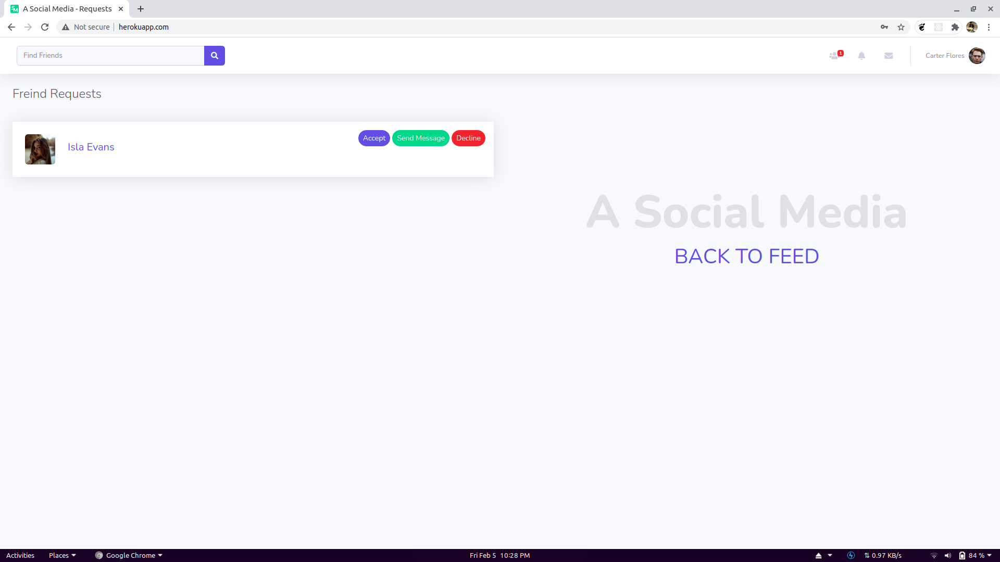
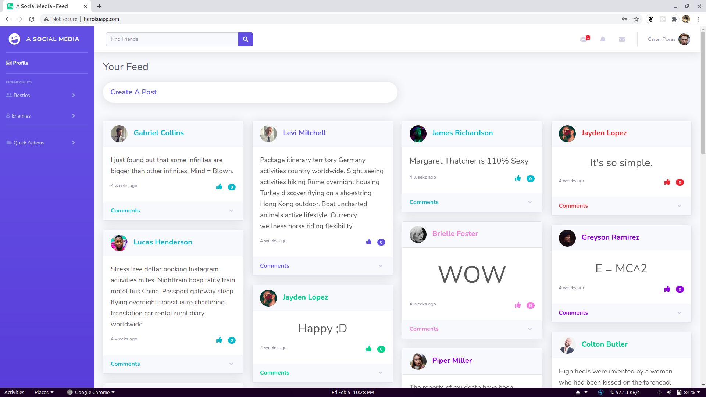

[](https://badges.pufler.dev) [](https://badges.pufler.dev) [](https://badges.pufler.dev)

# [A Social Media](https://xunbao.elementsculmyca.com/)
[](https://forthebadge.com) [](https://forthebadge.com) [](https://forthebadge.com) [](https://forthebadge.com) [](https://forthebadge.com)


## Table of Contents

* [About the Project](#about-the-project)
  * [Built With](#built-with)
* [Getting Started](#getting-started)
  * [Prerequisites](#prerequisites)
  * [Installation](#installation)
  * [Usage](#usage)
* [Frontend](#frontend)
    * [Angular](#angular)
* [Backend](#backend)
    * [Express](#express)
    * [MongoDB](#mongodb)
* [Screenshots](#screenshots)
* [Authors](#authors)
* [Contributing](#contributing)
* [License](#license)

## About the Project
[A_Social_Media](http://whispering-hollows-06439.herokuapp.com/) is a fully-functional Social Media Plarform, integrated with :

1. MongoDB - for storing data in Back-End.
2. Express, for Back-End prgramming
3. Angular, for Single-Page Fnrontend Application. 

### Built With
*   Node.js
*   Express
*   Angular
*   MongoDB

[Back to Table of Contents](#table-of-contents)

## Getting Started
### Prerequisites
* Node.js
* Angular
* MongoDB
* Express


### Installation


* Backend

  * Node.js
  
    ```
    $ sudo apt install nodejs
    $ sudo apt install npm
    $ npm install -g express
    ```
  
  
  * MongoDB

    ```
    $ npm install mongod
    $ sudo systemctl start mongod
    ```
    
* Frontend

  * Angular
    
    ```
    $ npm install -g @angular/cli
    ```
  

### Usage

* To Run Server
    
    ``` 
    $ npn start
    ```
    
    
* To Run Angular Page

    ``` 
    $ cd angular
    $ ng serve
    ```
    
[Back to Table of Contents](#table-of-contents)

## Frontend

* #### Angular
    Angular is an application design framework and development platform for creating efficient and sophisticated single-page apps.
    It uses modern web platform capabilities to deliver app-like experiences. High performance, offline, and zero-step installation.
    
    * ###### Why Angular ?
      * Cross Platform - Progressive Web Apps, Native and Desktop
      * Easy Code Generation & Code Splitting
      * Ridiculously fast
      * Simple and powerful template syntax.
    

## Backend

* #### Express
    Express is a minimal and flexible Node.js web application framework that provides a robust set of features for web and mobile applications.
    
    * ###### Why Express ?
        *  Ridiculously fast
        *  creating a robust API is quick and easy.
        *  provides a thin layer of fundamental web application features
        *  Incredibly versatile
        *  Easy to Integrate with Node frameworks
        
* #### MongoDB
    MongoDB is a source-available cross-platform document-oriented database program. Classified as a NoSQL database program, MongoDB uses JSON-like documents with     optional schemas. MongoDB is developed by MongoDB Inc. and licensed under the Server Side Public License (SSPL).
    
    * ###### Why MongoDB ?
      * Multi-cloud database service available on AWS, Google Cloud, and Azure.
      * Rich JSON Documents
      * Powerful query language

## Features

* #### Login and Registration
    *  Registration and login for User
    *  User can view his/her profile

* #### Feed Section
    *  User can view feed section, only after registration, or login
    *  User can create new posts.
    *  User can like and comment on posts.
    *  User can view his/her friends post in feed section. 

* #### Profile
  
    *  User can view his/her profile
    *  User can view his/her friends.
    *  User can see new friend's suggestions.
    *  User can send or recieve friend request.
    *  User can message any user, from his/her profile.

* #### Messages

    * User can start a coversation with a friend.
    * User can delete messages
    
* #### Extra Features
     
     * User can see General Alerts, Notification, and Message Alerts, from the home page.


[Back to Table of Contents](#table-of-contents)
## Screenshots

      
       
     

